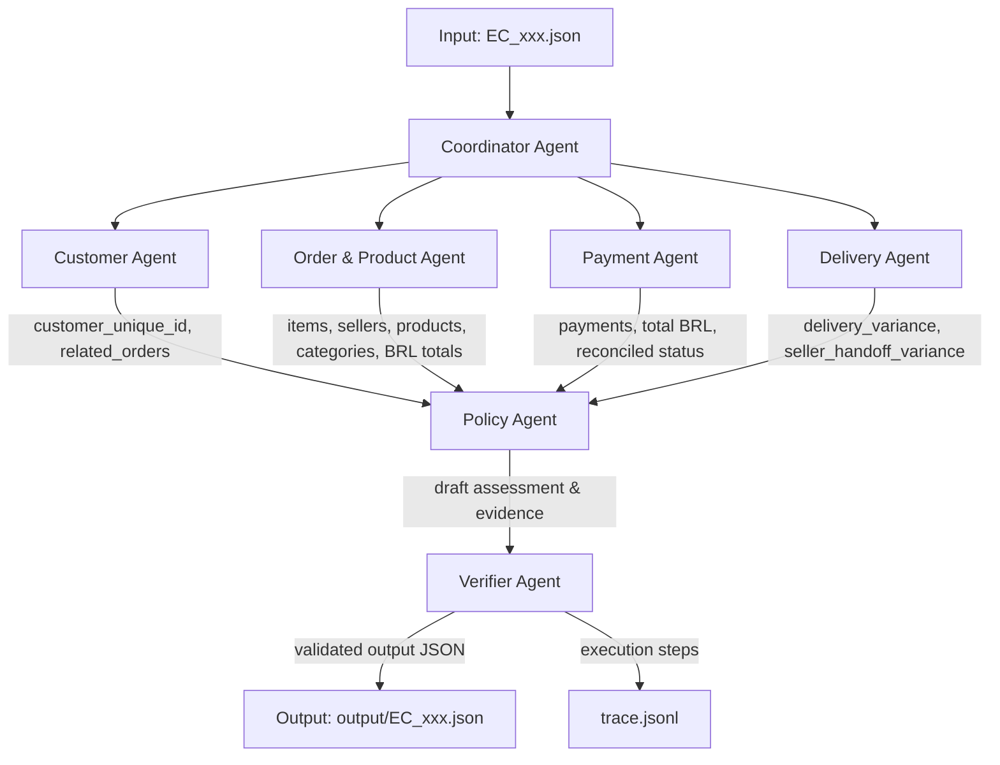

# Kiến Trúc Hệ Thống Multi-Agent — E-Commerce Dispute Resolution

## 1. Sơ Đồ Tổng Quan (Multi-Agent Architecture Diagram)

Hệ thống được thiết kế theo mô hình **Phân Cấp & Chuyên Môn Hóa (Hierarchical & Specialized Multi-Agent)**. Mỗi agent đảm nhận duy nhất một góc nhìn dữ liệu (domain context), thực hiện phân tích và handoff dữ liệu cho Agent tiếp theo thông qua Hợp đồng Dữ liệu (Data Contract) chặt chẽ.

---

## 2. Vai Trò & Quyền Truy Cập Của Các Agent (Agent Roles & Data Access)

| Agent Name | Vai Trò Chính | Quyền Truy Cập Dữ Liệu | Output Handoff |
| :--- | :--- | :--- | :--- |
| **Coordinator Agent** | Tiếp nhận case input, điều phối luồng thực thi và tổng hợp kết quả cuối cùng. | Read: `input/EC_xxx.json` Write: `output/EC_xxx.json` | Phân công task & tổng hợp JSON schema |
| **Customer Agent** | Nhận diện danh tính khách hàng (`customer_unique_id`) và lịch sử mua hàng. | Read: `olist_customers_dataset.csv` `olist_orders_dataset.csv` | `customer_unique_id`, `related_order_ids`, `has_repeat_customer` |
| **Order & Product Agent** | Phân tích chi tiết dòng hàng (items), sản phẩm, seller và danh mục sản phẩm. | Read: `olist_order_items_dataset.csv` `olist_products_dataset.csv` `olist_sellers_dataset.csv` `product_category_name_translation.csv` | `item_ids`, `seller_ids`, `product_ids`, `category_names`, `expected_total_brl`, multi-flags |
| **Payment Agent** | Phân tích các dòng thanh toán, tính tổng tiền và đối soát tài chính với giá trị đơn. | Read: `olist_order_payments_dataset.csv` | `payment_ids`, `payment_total_brl`, `difference_brl`, `reconciled`, `payment_types` |
| **Delivery Agent** | Phân tích mốc thời gian giao hàng, độ trễ vận chuyển và trách nhiệm bàn giao của seller. | Read: `olist_orders_dataset.csv` `olist_order_items_dataset.csv` | `delivery_variance_hours`, `seller_handoff_analysis`, `late_handoff_seller_ids` |
| **Policy Agent** | Áp dụng ma trận quyết định `EC_POLICY_V2`, phân loại primary/secondary issues, số tiền hoàn và hành động. | Internal Knowledge: Quy tắc `EC_POLICY_V2` | `primary_issue`, `secondary_issues`, `case_status`, `recommended_refund_brl`, `evidence_ids`, `actions` |
| **Verifier Agent** | Thẩm định toàn bộ kết quả output trước khi ghi file. Kiểm tra schema, giới hạn mảng, rounding, null-handling. | Output JSON Contract & Schema rules | `is_valid` (Boolean) & danh sách lỗi nếu có |

---

## 3. Luồng Handoff Dữ Liệu & Hợp Đồng Dữ Liệu (Handoff Flow & Data Contracts)

1. **Step 1 (Coordinator &rarr; Sub-Agents)**:
   - Coordinator nhận `claimed_order_id` từ file input, kích hoạt song song/nối tiếp Customer, Order/Product, Payment, Delivery Agents.

2. **Step 2 (Sub-Agents &rarr; Policy Agent)**:
   - Customer Agent handoff danh tính `customer_unique_id` và danh sách `related_order_ids` (giới hạn tối đa 5).
   - Order & Product Agent handoff `expected_total_brl` = $\sum \text{price} + \sum \text{freight\_value}$.
   - Payment Agent handoff `payment_total_brl`, `difference_brl` và trạng thái `reconciled` ($|\text{difference\_brl}| \le 0.10$ BRL).
   - Delivery Agent handoff `delivery_variance_hours` (so với estimated date) và `seller_handoff_analysis` (so với shipping limit date).

3. **Step 3 (Policy Agent &rarr; Verifier Agent)**:
   - Policy Agent đánh giá ma trận ưu tiên `EC_POLICY_V2`:
     1. `canceled_order_paid` / `unavailable_order_paid` &rarr; Platform chịu trách nhiệm.
     2. `late_delivery_seller` &rarr; Sellers bàn giao muộn chịu trách nhiệm.
     3. `late_delivery_logistics` &rarr; Đơn vị vận chuyển chịu trách nhiệm.
     4. `valid_split_payment` / `unsupported_late_claim` &rarr; Không bên nào chịu trách nhiệm, refund = 0.
   - Thêm các secondary issues theo đúng thứ tự: `multi_item_order` &rarr; `multi_seller_order` &rarr; `split_payment` &rarr; `repeat_customer` &rarr; `multiple_categories`.
   - Tạo danh sách Evidence IDs hợp lệ và danh sách Resolution Actions.

4. **Step 4 (Verifier Agent &rarr; Coordinator & Output)**:
   - Verifier Agent kiểm duyệt 11 điều kiện ràng buộc khắt khe (Schema, array limits: order_ids $\le 5$, item_ids $\le 5$, seller_ids $\le 3$, payment_ids $\le 5$, related_order_ids $\le 5$, product_ids $\le 5$, categories $\le 5$, evidence_ids $\le 20$, actions $\le 5$).
   - Coordinator ghi kết quả thành công ra file `output/EC_xxx.json` và log lại từng step vào `trace.jsonl`.

---

## 4. Cam Kết Đồng Bộ Với Đề Bài (`README.md`)

- **Định dạng evidence IDs**: Chỉ chứa 5 tiền tố hợp lệ `order:`, `item:`, `payment:`, `seller:`, `policy:`.
- **Xử lý Null**: Với đơn hàng không có item row, các chỉ số `expected_total_brl`, `difference_brl`, `reconciled` được thiết lập chính xác về `null`, các mảng item/seller/product/category/seller_handoff về `[]`.
- **Làm tròn số liệu**: Mọi phép tính tiền BRL và số giờ độ lệch thời gian đều được làm tròn 2 chữ số thập phân (`round(val, 2)`).
- **Tính ổn định của mảng**: Thứ tự các secondary issues và resolution actions luôn tuân thủ chính xác thứ tự nghiệp vụ quy định tại Section 4 trong `README.md`.
